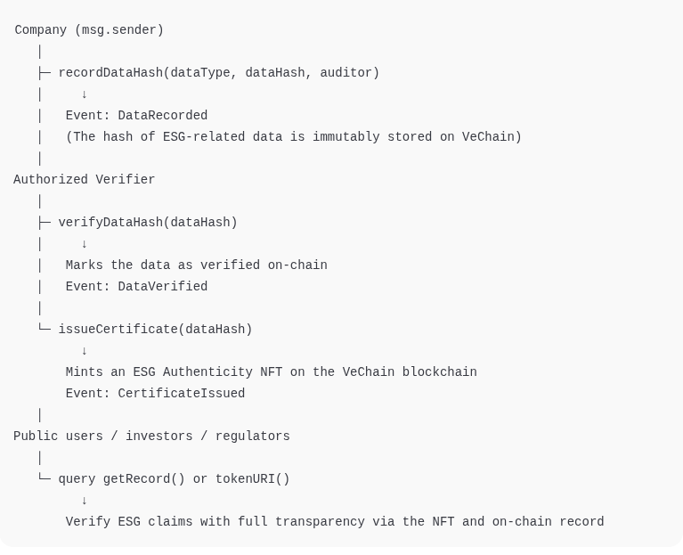

# VeriESG — Sustainable Verification Infrastructure on VeChain

A comprehensive ESG (Environmental, Social, and Governance) verification platform built on VeChain blockchain, designed to ensure transparency, traceability, and trust in corporate sustainability claims through automated validation with external data sources and immutable proof recording.

## 🎯 Project Overview

**Purpose:** Provide a multi-layer verification system that validates ESG claims against authoritative external sources and records immutable proofs on VeChain blockchain, enabling transparent and auditable sustainability reporting.

**Target:** Corporate sustainability reporting, ESG auditing, and regulatory compliance with blockchain-backed verification.

## 🏗️ Architecture Overview

The platform implements a 4-layer architecture for comprehensive ESG verification:

### Layer 1 – Immutability Registration (Core Blockchain Layer)
- **Blockchain:** VeChainThor
- **Function:** Store hashes of verified documents, measurements, and data ensuring proof of authenticity and integrity
- **Features:**
  - VeChain ToolChain for corporate data onboarding and traceability
  - VeTrust / VeID for entity authentication (companies and validators)
  - Smart Contracts for ESG Authenticity Seal issuance (NFT/Token SBT)

### Layer 2 – Validation & Integration (Data Verification Layer)
- **Function:** Integrate external sources to validate claims through APIs, oracles, and AI connectors
- **Data Sources:**
  - NASA Power API → solar radiation, temperature, precipitation
  - Copernicus / Sentinel (ESA) → land use data, emissions, fire detection
  - NOAA / IBAMA / MapBiomas → preservation areas, reforestation, deforestation
  - Carbon Interface / Climatiq API → carbon footprint validation
  - ISO / GRI APIs → certification standards validation

### Layer 3 – Intelligent Verification (Logic & AI Layer)
- **Function:** AI and deterministic rules to compare claims vs. real data
- **Example Process:**
  - Company reports: "10,000 kWh/month solar energy in Cuiabá"
  - System queries NASA Power API for average radiation data
  - Compares with expected panel efficiency
  - Generates ESG plausibility index

### Layer 4 – Certification & Reputation (Proof Layer)
- **Function:** Issue ESG legitimacy NFTs on VeChain when verification is completed
- **NFT Contents:**
  - Hash of original data
  - Verification date
  - Sources used
  - ESG credibility index
  - Authenticity stamp and auditor

## 👥 User Personas & Use Cases

### 🏢 Persona 1 – Company (Claimant)
**Examples:** Solar energy companies, agribusiness, green construction, industries with sustainability goals

**Motivations:**
- Meet ESG goals in an auditable and trustworthy manner
- Increase credibility with investors and regulators

**Actions:**
- Submit reports or documents (PDFs, spreadsheets, internal APIs)
- Receive ESG verification seal (NFT) for display on website, marketplace, or reports

### 🔍 Persona 2 – ESG Auditor / Consulting
**Examples:** PwC, EY, or green auditing startups

**Motivations:**
- Reduce manual audit costs
- Automate part of verification and blockchain registration

**Actions:**
- Use validation dashboard to review data before seal issuance
- Digitally sign as authorized validator (VeID)

### 💼 Persona 3 – ESG Investor / Fund Manager
**Motivations:**
- Validate legitimacy of portfolio ESG metrics
- Access "public proofs" of on-chain sustainability

**Actions:**
- Query platform or use public API to verify ESG NFTs

### 🏛️ Persona 4 – Regulator / Certifier
**Examples:** IBAMA, INMETRO Verde, UN, GRI

**Motivations:**
- Facilitate compliance and automated auditing

**Actions:**
- Integrate their database with platform for cross-validation

## 📋 Supported ESG Claim Types

| Claim Type | Example | Verification Integration |
|------------|---------|-------------------------|
| Renewable Energy | Solar, wind, hydroelectric generation | NASA Power API, Copernicus, average efficiency data |
| CO₂ Emissions | Corporate carbon footprint | Climatiq API, Carbon Interface |
| Reforestation / Offset | Tree planting, legal reserve areas | MapBiomas, RAISG, satellite data |
| Waste Management | Recycling, composting reports | IBAMA, SINIR |
| Water Consumption | Reduction and reuse | ANA (National Water Agency), regional data |
| Land Use / Sustainable Agriculture | Agricultural practice certification | IBGE, INPE, MapBiomas |
| Social Transparency / Governance | Diversity policies, compliance, social impact | ESG certifiers (ISO 26000, GRI Standards) |

## 🚀 Implementation Status

### ✅ Completed Features
- **Smart Contract:** VeriESG contract deployed on VeChain testnet
- **Frontend Application:** React/Next.js dApp with VeChain integration
- **Mock Services:** Complete simulation of blockchain interactions and AI verification
- **User Interface:** ESG claim submission form with verification workflow
- **Blockchain Integration:** VeChain DAppKit integration for wallet connection

### 🔧 Technical Implementation
- **Smart Contract Address:** `0xc8011F2C01cF1a02BF8dcA15A949AfA45E5d3FAE`
- **Network:** VeChain Testnet
- **Frontend:** Next.js 15 with TypeScript
- **Blockchain SDK:** @vechain/dapp-kit-react
- **Styling:** Tailwind CSS with custom design system

### 🧪 Testing & Development
- **Mock Services:** Implemented for development and testing
- **Contract Testing:** Hardhat-based testing with real VeChain testnet
- **Frontend Testing:** Component testing with mock data
- **Integration Testing:** End-to-end workflow simulation

## 🔮 Future Extensions

### Planned Features
- **Real Data Integration:** Connect to actual external APIs (NASA, Copernicus, etc.)
- **AI Verification:** Implement machine learning models for claim validation
- **Marketplace:** ESG data marketplace for validated information trading
- **Digital Seal Widget:** Website widget with QR code linking to on-chain proof
- **Multi-language Support:** Internationalization for global adoption
- **Mobile Application:** Native mobile app for field data collection

### Strategic Advantages
- Built on VeChain, already recognized in corporate ESG
- Modular verification applicable to any sector
- Public transparency via NFTs and smart contracts
- B2B2G scalability (Companies → Auditors → Governments)
- API-first design for integration with existing ERPs and ESG platforms

## 🛠️ Getting Started

### Prerequisites
- Node.js 18+
- VeChain wallet (VeWorld recommended)
- VeChain testnet VET for gas fees

### Installation
```bash
# Clone the repository
git clone <repository-url>
cd vchain

# Install dependencies
npm install

# Start development server
npm run dev
```

### Usage
1. Connect your VeChain wallet
2. Navigate to the verification page
3. Submit ESG claims through the form
4. View verification results and blockchain proofs

## 📊 On-Chain Architecture

The system follows a three-stage process:

1. **Company** records ESG data hashes on VeChain
2. **Authorized Verifier** verifies data and issues ESG Authenticity NFT
3. **Public users, investors, or regulators** query and verify ESG claims using on-chain records and NFTs



## 🤝 Contributing

This project was developed for the VeChain hackathon, focusing on sustainable verification infrastructure. Contributions and feedback are welcome for further development and real-world implementation.

## 📄 License

This project is developed for educational and hackathon purposes. Please refer to the license file for detailed terms.